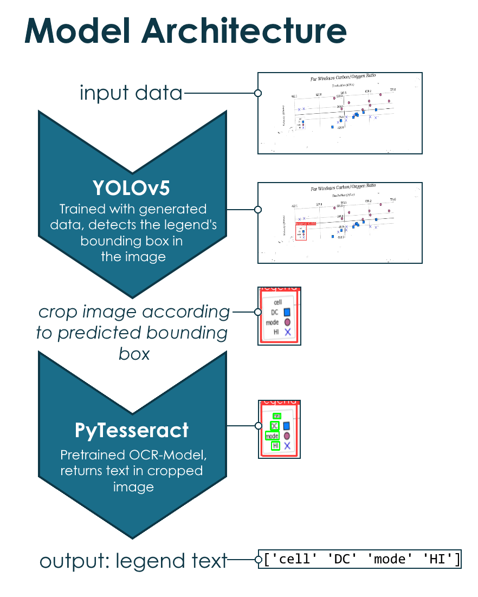

# Find a legend competition

Repository for competition "Find a legend" by xeek.ai (https://xeek.ai/challenges/extract-crossplot-markers).

## Problem Description

Througout the scientific community, a vast amount of information is contained within figures in papers, reports, and books. Without the raw data, this information can be lost altogether. We can increase our collective knowledge as a community if we develop a way to extract this information and convert it to a useful format for agregation and downstream analysis.

The goal of this challenge is to be able to extract the plot elements from the legend into a datatable. Elements in the legend will be listed in the order they appear on the legend and will be separated by a space.

Example: ['Type A' 'Type B' 'Type C']

### Data Description
1. Image files containing one graph per file.
2. CSV file containing the image file name and legend elements. These labels are to be used to train and test the model on the associated graphs.

## Solution Approach
To solve this task, the following approach is taken:

First, a YOLOv5s model is trained on generated data. These data can be found [here](generated_data/data3). For data generation, this [script](generated_data/data_generation.py) was used. Compared to the original data provided by the competition hosts, the generated data labels also contain the position of the legend box. The YOLOv5s model can now be created by first cloning the [YOLOv5 repository](https://github.com/ultralytics/yolov5). The directory [yolov5](yolov5/) of this repository, however, already corresponds to a clone of that very repository (with some files not necessary in this case deleted) and can be used to train a YOLOv5s model on our generated data ([tutorial](yolov5/tutorial.ipynb)). The weights of our trained model can be found [here](models_detection]. Loading these weights leads to a model that can be used to detect legends and their positions in a plot.

After applying the described model to the data to predict the position of the legend, the legends are cropped from the images according to the predictions of the model. 

Then a pretrained [PyTesseract model](models_ocr/pytesseract_model.py), used for Optical Character Recognition (OCR), is applied to the cropped image, returning the text in the legend. Afterwards, the results of this OCR model are post-processed. Optionally, some pre-processing methods provided in a separate [pre-processor class](models_ocr/preprocessing) can be applied before executing the OCR. In case more than one legend is (mistakenly) found by the YOLOv5 detection model, the OCR model is applied on all possible legends and the results are concatenated (usually, the OCR model will find no text if there is no legend). The output of the OCR model corresponds to the text within the legend in the form shown in the grafic above.

## Repository Contents
- [generated_data](generated_data): [data generation script](generated_data/data_generation.py) and data generated by this very script
- [misc](misc): miscellaneous files such as notebooks for test purposes, images, etc.
- [models_detection](models_detection): legend detection models, namely the [YOLOv5s model](models_detection/best.pt)
- [models_ocr](models_ocr): ocr models, namely the [PyTesseract model](models_ocr/pytesseract_model.py), and [pre-processing methods](models_ocr/preprocessing)
- [raw_data](raw_data): data provided by the organisers of the competition
- [results](results): different results for the test data of the competition
- [runs](runs): results of the runs of the YOLOv5 model
- [yolov5](yolov5): cloned yolov5 repository (some files not necessary in this case deleted)
- [plot_legend_detection.ipynb](plot_legend_detection.ipynb): autonomous notebook to create a submission for the competition by using the model architecture above

